# IDE Integration Guide — Driving the Arduino-Arabic Compiler from an IDE

> Audience: the teammate building the **IDE** for the Arabic compiler.
>
> Golden rule: **the IDE is a shell, the compiler is the engine.** Do **not**
> reimplement lexing/parsing/analysis inside the IDE. Call the compiler stages
> you already built (lexer → parser → AST builder → semantic analyzer → IR
> generator → optimizer → AVR backend) and render their outputs and errors.
>
> This guide also folds in **Lab 28** (the empathetic compiler: custom error
> listener + AI mentor + TDD), because friendly diagnostics and a test runner
> are exactly what an IDE should surface.

---

## 1. The pipeline you already have

```mermaid
flowchart LR
    SRC["كود عربي (.ar source)"] --> LEX["Lexer\nArArduinoLexer"]
    LEX --> TOK["Token stream"]
    TOK --> PAR["Parser\nArArduinoParser"]
    PAR --> TREE["Parse tree"]
    TREE --> AST["AST builder\nast_builder"]
    AST --> SEM["Semantic analyzer\n(types, symbols, errors)"]
    SEM --> IR["IR generator\nLLVM IR (raw)"]
    IR --> OPT["Optimizer\nLLVM IR (optimized)"]
    OPT --> BE["AVR backend\n.o -> link -> .hex"]
    BE --> FLASH["avrdude flash + Serial monitor"]
```



Each stage can either **succeed** (produces the next artifact) or **fail**
(produces diagnostics). The IDE’s job is to call each stage, show its artifact
in a panel, and turn its diagnostics into editor markers.

---

## 2. Step 1 — Wrap the pipeline in ONE facade (`compiler_api.py`)

Right now the logic lives inside `main.py` and **prints** results. For an IDE
you must refactor it into functions that **return data** (and never call
`exit()` / `print()` for control flow). Create `compiler_api.py` that the IDE
imports. Your CLI `main.py` can call the same facade, so you don’t fork logic.

```python
# compiler_api.py  (adapt the import paths/class names to your repo)
from dataclasses import dataclass, field
from antlr4 import InputStream, CommonTokenStream

from frontend.ArArduinoLexer import ArArduinoLexer
from frontend.ArArduinoParser import ArArduinoParser
from frontend.ast_builder import ASTBuilder            # your tree -> AST visitor
from semantic.semantic_analyzer import SemanticAnalyzer
from backend.ir_generator import IRGeneratorVisitor
from backend.optimizer import Optimizer
from error_handler import ArabicErrorListener, ask_ai_mentor   # Lab 28


@dataclass
class Diagnostic:
    line: int
    column: int
    severity: str          # "error" | "warning"
    message: str           # raw technical message
    stage: str             # "lexer" | "parser" | "semantic"
    ai_message: str = ""   # filled lazily by the AI mentor (Lab 28)


@dataclass
class CompileResult:
    stage_reached: str = "start"
    tokens: list = field(default_factory=list)
    ast: object = None
    ir_raw: str = ""
    ir_opt: str = ""
    asm: str = ""
    obj_path: str = ""
    hex_path: str = ""
    diagnostics: list = field(default_factory=list)

    @property
    def ok(self):
        return not any(d.severity == "error" for d in self.diagnostics)
```

### Per-stage functions (each returns artifact + diagnostics)

```python
def _make_parser(source):
    listener = ArabicErrorListener()           # collects, does not print
    lexer = ArArduinoLexer(InputStream(source))
    lexer.removeErrorListeners(); lexer.addErrorListener(listener)
    tokens = CommonTokenStream(lexer)
    parser = ArArduinoParser(tokens)
    parser.removeErrorListeners(); parser.addErrorListener(listener)
    return lexer, tokens, parser, listener


def tokenize(source):
    """Fast: feed the IDE's syntax highlighter."""
    lexer = ArArduinoLexer(InputStream(source))
    toks = []
    tok = lexer.nextToken()
    while tok.type != -1:  # Token.EOF
        toks.append((tok.type, tok.text, tok.line, tok.column))
        tok = lexer.nextToken()
    return toks


def parse(source):
    _, tokens, parser, listener = _make_parser(source)
    tree = parser.program()                    # your top rule
    diags = [Diagnostic(e["line"], e["column"], "error", e["raw_msg"], "parser")
             for e in _as_dicts(listener.errors)]
    return tree, diags


def analyze(source):
    """Lexer + parser + semantic. This is what the editor calls on edit."""
    tree, diags = parse(source)
    if any(d.severity == "error" for d in diags):
        return None, diags                     # don't analyze a broken tree
    ast = ASTBuilder().visit(tree)
    sem = SemanticAnalyzer()
    sem.analyze(ast)                           # your analyzer fills sem.errors
    for e in sem.errors:                       # log_error(line, column, msg)
        diags.append(Diagnostic(e["line"], e["column"], "error", e["msg"], "semantic"))
    return ast, diags


def generate_ir(source):
    ast, diags = analyze(source)
    if ast is None or any(d.severity == "error" for d in diags):
        return "", diags
    ir_gen = IRGeneratorVisitor()
    ir_gen.visit(ast)
    return str(ir_gen.module), diags


def optimize_ir(ir_raw):
    return Optimizer(opt_level=2, size_level=1).optimize(ir_raw)
```

### One call the IDE’s “Build” button uses

```python
def full_compile(source, upto="hex"):
    """upto in {tokens, parse, semantic, ir, opt, asm, object, hex}."""
    res = CompileResult()
    res.tokens = tokenize(source); res.stage_reached = "tokens"
    if upto == "tokens": return res

    ast, diags = analyze(source)
    res.ast, res.diagnostics = ast, diags
    res.stage_reached = "semantic"
    if not res.ok or upto in ("parse", "semantic"):
        return res

    res.ir_raw, _ = generate_ir(source); res.stage_reached = "ir"
    if upto == "ir": return res
    res.ir_opt = optimize_ir(res.ir_raw); res.stage_reached = "opt"
    if upto == "opt": return res

    # backend (see BACKEND_PLAN_AVR.md for avr_target / link_and_flash)
    from backend.avr_target import initialize_avr_target_machine
    import llvmlite.binding as llvm
    tm, triple = initialize_avr_target_machine()
    mod = llvm.parse_assembly(res.ir_opt); mod.verify()
    mod.triple = triple; mod.data_layout = str(tm.target_data)
    res.asm = tm.emit_assembly(mod); res.stage_reached = "asm"
    if upto == "asm": return res
    open("output.o", "wb").write(tm.emit_object(mod))
    res.obj_path = "output.o"; res.stage_reached = "object"
    if upto == "object": return res
    # link + hex handled by backend.linker.link_and_flash(...)
    res.hex_path = "firmware.hex"; res.stage_reached = "hex"
    return res
```

> The exact class/method names (`ASTBuilder.visit`, `SemanticAnalyzer.analyze`,
> `sem.errors` shape, `IRGeneratorVisitor.module`) must match your real code —
> wire them to whatever the middle-end teammate exposed. The **shape** is the
> point: every stage returns `(artifact, diagnostics)`.

---

## 3. Step 2 — Live diagnostics in the editor  *(Lab 28, Step 1)*

The `ArabicErrorListener` from Lab 28 already **collects** errors instead of
printing them. That is exactly what an IDE needs: turn each `Diagnostic` into an
editor marker (red squiggle) at `(line, column)` with `message` as the tooltip.

- Syntax errors come from the listener attached to lexer + parser.
- Semantic errors come from `semantic_analyzer`’s `log_error(line, column, msg)`.
- Map both into the same `Diagnostic` list so the editor has one source of
  truth for markers.

Most editor components (Monaco, CodeMirror 6, Qt Scintilla) accept a list of
`{startLine, startCol, endCol, severity, message}` — build it from
`analyze(source).diagnostics`.

---

## 4. Step 3 — The AI Mentor panel  *(Lab 28, Step 2)*

Lab 28’s `ask_ai_mentor(code_line, error_info)` turns a dry error into a
friendly Arabic explanation. In an IDE, **don’t** call it on every keystroke —
it’s a network call. Instead:

- Trigger it **lazily**: on hover over a squiggle, or on a “حلّل الخطأ / Explain”
  button, or for the first error only.
- Run it on a **background thread** so typing never blocks.
- **Cache** by `(line, raw_message)` so the same error isn’t re-sent.
- Keep the **offline fallback** from the lab (when the network/API is down).
- Keep the API key in IDE settings / environment, never hardcoded.

```python
import threading
_ai_cache = {}

def explain_async(diag, source_lines, on_done):
    key = (diag.line, diag.message)
    if key in _ai_cache:
        on_done(_ai_cache[key]); return
    def work():
        line_txt = source_lines[diag.line - 1] if diag.line-1 < len(source_lines) else ""
        advice = ask_ai_mentor(line_txt, {"line": diag.line, "raw_msg": diag.message})
        _ai_cache[key] = advice
        on_done(advice)                       # marshal back to UI thread
    threading.Thread(target=work, daemon=True).start()
```

Render the returned text in a side panel next to the error — this is the
“empathetic compiler” experience from the lab, now interactive.

---

## 5. Step 4 — IDE features mapped to compiler stages

| IDE feature | What it calls | When to run |
|---|---|---|
| Syntax highlighting | `tokenize(source)` | every keystroke (debounced), worker thread |
| Error squiggles | `analyze(source).diagnostics` | on edit (debounced ~300 ms) |
| “Explain error” panel | `ask_ai_mentor` (cached, async) | on hover / button |
| AST tree view | `analyze(source).ast` | on demand |
| LLVM IR (raw) panel | `generate_ir(source)` | on demand / on build |
| LLVM IR (optimized) panel | `optimize_ir(ir_raw)` | on demand / on build |
| AVR assembly panel | backend `emit_assembly` | on build |
| Build (.hex) | `full_compile(source, upto="hex")` | Build button, subprocess |
| Flash / Upload | `backend.linker.link_and_flash(do_flash=True)` | Flash button |
| Serial Monitor | `pyserial` on the chosen port/baud | after flash |
| Run tests | `python -m unittest` (Lab 28 TDD) | Test button |

---

## 6. Step 5 — Threading & responsiveness (critical)

- **Fast stages** (lexer, parser, semantic) are pure Python → run them on a
  **debounced worker thread** on each edit. Cancel the previous run if the user
  keeps typing.
- **Slow stages** (IR → object → link → flash) need the AVR toolchain and disk
  → run them only on an explicit **Build / Flash** click, in a **subprocess**,
  and stream stdout/stderr into an Output panel.
- **Never** run `ask_ai_mentor` or `avrdude` on the UI thread.
- After a flash, opening the Serial Monitor grabs the port — make sure the IDE
  **releases the port before flashing again** (avrdude needs it).

---

## 7. Step 6 — Build / Flash toolbar wiring

- **Board / port pickers:** enumerate serial ports with
  `serial.tools.list_ports.comports()` (pyserial); let the user choose
  `/dev/ttyACM0`, `COM3`, etc.
- **Status bar usage meter:** after building, parse `avr-size --mcu=... -C
  firmware.elf` and show `flash 41% / RAM 12%` so the user sees they’re within
  the 32 KB / 2 KB budget.
- **Build then Flash:** call `link_and_flash(do_flash=False)` for Build, and
  `do_flash=True` for Upload (see `BACKEND_PLAN_AVR.md` §8.3).
- Surface link errors (undefined `setup`/`loop`/`c_*`/`panic_div_zero`) in the
  Output panel verbatim — they’re the backend’s contract failing.

---

## 8. Step 7 — Test runner integration  *(Lab 28, Step 4)*

Lab 28 starts a TDD harness with `unittest`. Wire a **“Run Tests”** button that
runs `python -m unittest` and parses the result into a green/red panel.

Adapt the lab’s assertion for AVR: there is no `output.o` to *run*, so assert
the build artifacts exist and are non-empty instead:

```python
import unittest, subprocess, os

class TestArabicCompiler(unittest.TestCase):
    def test_builds_hex(self):
        with open("test_sketch.ar", "w", encoding="utf-8") as f:
            f.write('دالة اعداد():فارغ { }\nدالة تكرار():فارغ { }\n')
        subprocess.run(["python", "main.py", "test_sketch.ar"], check=True)
        self.assertTrue(os.path.exists("firmware.hex"), "hex not produced")
        self.assertGreater(os.path.getsize("firmware.hex"), 0)
        os.remove("test_sketch.ar")

if __name__ == "__main__":
    unittest.main()
```

IDE hook: run `python -m unittest -v` via subprocess, regex the
`ok` / `FAIL` / `ERROR` lines into per-test rows. This protects the compiler
against regressions as you keep editing it.

---

## 9. Step 8 — Architecture if the IDE is NOT Python

If the IDE is Electron/VS Code/Qt-C++, don’t embed Python objects directly.
Wrap `compiler_api.py` as a tiny **JSON server** the IDE talks to:

- Input: `{ "action": "analyze", "source": "..." }`
- Output: `{ "diagnostics": [...], "ir": "...", "stage": "semantic" }`
- Transport: stdin/stdout line-delimited JSON, or a localhost socket
  (JSON-RPC / a small Flask endpoint).

This keeps the compiler as the single source of truth and lets any front-end
framework drive it. A VS Code extension can even speak the **Language Server
Protocol** — map `analyze().diagnostics` to LSP `Diagnostic`, `tokenize()` to
semantic tokens, and the AI mentor to `textDocument/codeAction`.

---

## 10. Suggested IDE architecture

```
ide/
  editor/            # Monaco / CodeMirror / Qt Scintilla widget
  language_service/  # talks to compiler_api (in-process or JSON server)
  panels/
    diagnostics/     # markers + AI mentor side panel (Lab 28)
    ir_view/         # raw + optimized LLVM IR
    asm_view/        # AVR assembly
    output/          # build/flash logs
    serial_monitor/  # pyserial
    tests/           # unittest results (Lab 28 TDD)
  toolbar/           # Build, Flash, Port picker, Board picker, size meter
compiler_api.py      # the facade over lexer/parser/semantic/IR/opt/backend
```

---

## 11. Checklist for the IDE teammate

- [ ] Refactored `main.py` logic into `compiler_api.py` functions that **return**
      `(artifact, diagnostics)` and never `print`/`exit` for control flow.
- [ ] Attached `ArabicErrorListener` to **both** lexer and parser; removed the
      default ANTLR listeners.
- [ ] Merged parser + semantic errors into one `Diagnostic` list → editor markers.
- [ ] AI mentor runs **async + cached + offline-fallback**, never on the UI thread.
- [ ] Fast stages debounced on edit; slow stages only on Build/Flash, in subprocess.
- [ ] Build button shows IR / optimized IR / AVR asm panels from the real stages.
- [ ] Flash button uses the backend’s `link_and_flash`; port chosen via pyserial.
- [ ] Serial Monitor releases the port before re-flashing.
- [ ] “Run Tests” runs `unittest` and shows green/red (asserts `firmware.hex`).
- [ ] Size meter parses `avr-size` to show flash/RAM budget.

That’s the whole IDE story: **wrap the existing stages in one facade, render
their artifacts in panels, turn their diagnostics into markers, layer the AI
mentor and test runner on top, and call the AVR backend for Build/Flash** —
without duplicating a single line of compiler logic.
